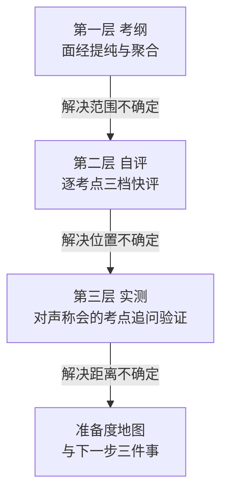
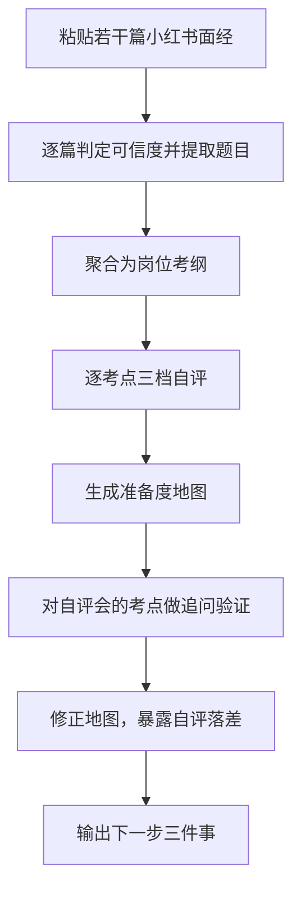
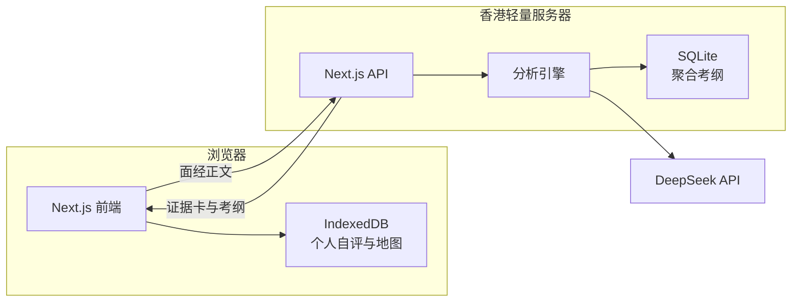

# 情报驱动的 AI 面试官 · PRD

> 产品名：**情报驱动的 AI 面试官**。
> 「底气」只是情绪隐喻（备考焦虑的反面），不当对外品牌名。
> 一句话定位：把你手里的面试情报喂进来，AI 照这个组的真实考法追问你。
> 本文档同时作为最终提交的 Product Memo 骨架。

## 0. 一句话定义

面向大厂技术实习的 **情报驱动 AI 面试官**：核心输入是 **简历 × JD × 面试情报**。在简历与 JD 之外，把"这个组真实考过什么"的情报当作第一等公民，据此生成贴近真实考法的面试提纲，再用多轮追问验证掌握是否站得住。辅路径仍保留把小红书面经提纯成**考纲**、生成个人**准备度地图**的能力。

### 0.1 为什么是「情报驱动」

真正有价值的情报很多不在搜索引擎里。情报来源分两条路：

- **系统自动获取**（接入中）：公开面经、GitHub 面经仓库、牛客/博客/论坛等公开可检索页面、学校复试经验、岗位招聘信息、用户授权的公开资料。
- **用户主动提供**（当前主力，也是护城河）：师兄一手经验、微信整理的面经、PDF、截图、Markdown/TXT、URL、直接粘贴文本。

第二条尤为关键——很多真情报根本搜不到。每条情报带 `source` 与用户标注的 `trust`（high 一手 / medium 公开 / low 存疑），影响出题权重。情报里反复出现、该组真实考过的点会被标为 `intel_hit`，出题优先级最高。

## 1. 目标用户

准备大厂技术类实习面试的本科生（大二、大三为主）。

进一步收窄的锚点用户：**正在准备后端方向暑期实习、已经在小红书搜过面经、且处于焦虑状态的学生**。

为什么要窄：不同岗位的面经形态差异极大（算法岗谈论文、前端谈八股、后端谈项目），只有把单一岗位的样本密度做够，考纲聚合才有统计意义。样本铺得越广，每个岗位下越空。

## 2. 真实痛点

以下为待验证假设，调研记录写入 `docs/research.md`。

### 2.1 信息层

- H1：学生找面经的第一入口是小红书而非牛客，因为刷得到、门槛低
- H2：小红书面经中相当比例是机构引流内容，题目泛化、缺少追问链
- H3：学生无法判断一篇面经的真假与时效，只能靠感觉，且倾向于相信点赞高的
- H4：即使看了 20 篇面经，学生依然回答不出「这个岗位到底最常考什么」——信息散落在 20 个帖子里，从未被聚合过

### 2.2 情绪层

- H5：备考期学生长期处于焦虑状态，且焦虑并非来自懒惰，而是来自**不确定**
- H6：学生最深的恐惧不是「知道自己不会」，而是**「我以为我会的东西，可能其实不会」**
- H7：现有工具全部聚焦于提升能力，没有任何一个在处理情绪，而情绪恰恰是决定备考能否持续的变量

调研方式：微信访谈 5 名目标用户，每人 5 个问题，重点验证 H4 与 H6。

## 3. 核心洞察

### 洞察一：焦虑的解药是确定性，不是鼓励

学生的焦虑可以拆成三个具体的「不知道」：

- 不知道这个岗位到底要考什么（**范围**不确定）
- 不知道自己现在到什么水平（**位置**不确定）
- 不知道还差多少、下一步做什么（**距离**不确定）

因此产品不提供情绪安慰。ChatGPT 说「别紧张你可以的」比我们说得好，而学生自己清楚那是廉价安慰，看完更焦虑。

同理，**没有真实评估支撑的进度条会加重焦虑**，因为学生一眼就能识破它是假的。

本产品的做法是把三个不确定逐一变成确定：给出有据可依的考纲范围、你在范围内的真实位置、以及明确到只有三条的下一步。

「鼓励」的唯一正确形态是用事实鼓励——展示「你今早覆盖 12 个考点，现在 18 个」，而不是调整语气。

### 洞察二：商业意图与内容可用性是两件独立的事

一篇引流广告帖里的面试题可能完全真实（机构也需要真题来获客），一篇看似真诚的帖子也可能是拼凑编造的。

所以产品不做二元真假判定，而是输出两个独立结论：`verdict`（这篇帖子想干什么）和 `contentTrust`（里面的题目能不能用）。即使判定为广告，题目依然可能进入考纲。

这是本产品与「AI 内容检测器」类工具的根本差别，也是它能提供正向价值而不只是打假的原因。

## 4. 产品结构：三层



**第一层，考纲。** 把多篇面经提纯聚合，得出这个岗位真实考什么。这是整个产品的地基——没有可信的考纲，后面两层都是空中楼阁。

**第二层，自评。** 用户对每个考点做三档快评（会 / 模糊 / 不会），几分钟内得到初步地图。成本极低，反馈即时。

**第三层，实测。** 对用户声称「会」的考点做追问验证，把自评修正为实测。

第三层是产品的杀手锏。它让产品能对用户说出这样一句话：

> 你以为自己会的 12 个考点里，有 5 个经不起追问。

这正面击中 H6。学生焦虑的真正来源就是自评与实测之间的落差，把这个落差量化出来，反而是最强的安定剂——因为未知的恐惧变成了已知的清单。

## 5. 功能范围

### P0 今日必须完成

| 编号 | 功能 | 说明 |
|---|---|---|
| F0 | **简历 × JD 深挖面试** | 上传简历与岗位 JD，生成面试提纲并多轮追问验证 |
| F1 | 单篇可信度判定 | 五维证据卡，每个信号必须附原文引用 |
| F2 | 结构化提取 | 公司 / 岗位 / 轮次 / 面试时间 / 题目 / 追问链 / 结果 |
| F3 | 考纲聚合 | 多篇面经去重合并，可信度加权排序，可溯源 |
| F4 | 自评与准备度地图 | 三档快评，可视化覆盖度，输出下一步三件事 |
| F5 | Web 端 | 评委可直接访问体验的完整闭环 |
| F6 | 部署 | 香港轻量服务器 + HTTPS + 写入两个 SSH 公钥 |

### 简历 × JD 面试（主路径）

这是「AI 面试官」最直接的形态：

1. 用户粘贴 / 上传简历与目标岗位 JD
2. 引擎对照两者产出 4–6 个追问点：`resume_match`（重合深挖）、`resume_risk`（简历泡沫）、`jd_gap`（JD 有要求但简历弱）
3. 每个追问点最多两轮追问，只判定是否有新增可验证事实
4. 复盘页给出「经得起 / 经不起」清单
5. **进度可视化**：全程步骤条 + 环形覆盖率 + 进度条。数字必须来自真实进度，用来回答「我到哪了、还剩多少」，而不是给虚假满分。

引用简历/JD 原文时做代码级核验：模型编造的摘录直接丢弃。

面经考纲路径（F1–F4）作为第二条准备路径保留，用于「还没投、先摸清考什么」。

### P1 强烈希望完成

- F7 **实测层追问验证**：对自评为「会」的考点做 2 至 3 轮追问，判定是否真的掌握，修正地图

这是 demo 的 wow moment 所在。若时间允许必须做，哪怕只覆盖 3 个考点。

### P2 有余力才做

- F8 浏览器插件：在小红书页面实时标注可信度，并把浏览到的面经沉淀为语料
- F9 反问助手：基于面经中暴露的团队技术栈，生成有信息量的反问问题

### 刻意不做，以及原因

- **不做情绪安慰型鼓励**：廉价鼓励会稀释产品可信度，我们只用事实鼓励
- **不做爬虫**：风控与合规风险，且与本地优先的架构主张矛盾
- **不做语音视频**：题目已说明是加分项而非必选，性价比低
- **不做账号登录体系**：会直接增加评委的体验门槛
- **不输出数值评分**：分数一定会被追问校准依据，而 16 小时内无法建立可信的校准集
- **不做扫描件 OCR**：文字版 PDF/DOCX 可自动解析；纯图片扫描件请先转文字或粘贴

> 注：原「不做压力面模拟」已撤销。简历 × JD 深挖面试即主路径；压力感来自对简历原文的追问，而非角色扮演恐吓。

### 关于插件为何从 P0 降到 P2

原方案以浏览器插件为主形态。调整后降级，理由有三：评委必须能直接访问体验，Web 是刚需；准备度地图成为新的 wow moment，在 Web 上即可演示；插件的 DOM 适配与调试成本高，会挤占核心闭环的时间。

小红书作为数据源的地位不变，只是采集方式改为用户手工粘贴。这在 16 小时的约束下是诚实且够用的做法。

## 6. 核心机制

### 6.1 第一层 · 五维证据卡

#### commercial 商业意图

- 负向信号：文末引导私信、加微信、「扣 1」、「领资料」；出现机构名、课程名、内推码；评论区多条同质化引导话术
- 正向信号：全文无任何联系方式与转化引导

#### specificity 细节密度

真实性最强的单一指标。编造者能编出题目，编不出细节。

- 正向信号：存在追问链（「他接着问」「然后又问」）；具体报错信息、参数、版本号；具体时间地点（「9 月 12 日下午三面」）；面试官的具体行为（「面试官全程没开摄像头」）
- 负向信号：只有题目罗列而无上下文；「问了些八股」这类泛化描述；题目排列高度模板化

#### narrative 叙事完整性

- 正向信号：包含负面细节，如「这题我没答上来」「二面挂了」「紧张到卡壳」
- 负向信号：全程成功叙事，无任何挫折与犹豫

真实面经几乎必然包含失败与不确定；编造的内容倾向于呈现完整的爽文结构。

#### author 账号画像

- 负向信号：近 30 天发帖涉及 5 家以上不同公司的面经；账号内容题材单一且全为面经
- 无此数据时该维度降级为 `neutral`

#### recency 时效性

- 负向信号：面试时间距今超过 12 个月；提及已变更或下线的流程
- 正向信号：三个月以内

#### 输出硬约束

- `verdict` 输出三档，不给数值分
- 每个 `positive` 或 `negative` 信号必须携带至少一条 `quotes`，逐字摘自原文
- **若无法在原文中找到支撑证据，该维度必须输出 `neutral`**

最后一条是防幻觉的核心约束。宁可少判，不可臆造证据——产品的全部说服力建立在「每条结论都能被用户自己核验」之上。

### 6.2 第一层 · 考纲聚合算法

```
考点权重 = 可信度权重 x 时效衰减
```

- 可信度权重：`trustworthy` 1.0 / `suspicious` 0.4 / `promotional` 0.15
- 时效衰减：3 个月内 1.0 / 3 至 12 个月 0.6 / 12 个月以上 0.3
- 仅纳入 `contentTrust` 不为 `unusable` 的帖子
- 排序依据为权重求和，而非出现次数
- 去重：先按 `topic` 分组，再用 LLM 归并同考点的不同措辞
- 每个考点保留 `sources` 列表，可展开逐条溯源

### 6.3 第二层 · 自评

考点以卡片流呈现，每个考点三个按钮：会 / 模糊 / 不会。目标是三分钟内过完全部考点。

设计要点：不要求用户输入任何文字。此阶段的唯一目的是快速建立位置感，降低启动门槛。

### 6.4 第三层 · 实测追问验证

对用户自评为「会」的考点，抽取若干个进行 2 至 3 轮追问。

判定机制不是评价答案好坏，而是检测**信息增量**：

- 回答中出现新增的可验证事实，视为掌握，保持绿色
- 出现复述、「大概」「应该是」、转移话题，判定为未真正掌握，降级为黄色
- 明确表示不知道，直接降级

这个机制是显式的状态判定，而非让模型自由发挥语气。它是与「让 ChatGPT 扮演面试官」的根本区别。

### 6.5 准备度地图

以网格呈现全部考点，颜色语义：

- 深绿：实测确认掌握
- 浅绿：自评会，尚未验证
- 黄：模糊，或自评会但被追问打回
- 红：不会
- 灰：未评估

顶部展示三个数字：考点总数、当前覆盖数、**自评与实测的落差数**。

底部输出**下一步三件事**，按「考点权重 x 你的缺口」排序。

只给三条，不给完整清单。焦虑的人需要的是明确的下一步，一长串待办清单只会加重压力。

## 7. 用户流程



## 8. 交互设计

### 分析页

左侧粘贴框，右侧证据卡结果。点击某条 `quote` 时高亮原文对应位置——让用户自己核验，而不是要求他信任结论。

**必须提供 3 个示例一键填充**（一篇典型广告帖、一篇高质量真面经、一篇过时帖）。评委不会自己跑去小红书复制素材，没有示例按钮就等于没有 demo。

### 考纲页

按权重排序的考点列表，每个考点可展开查看来源于哪几篇面经、各自可信度如何。

### 自评页

卡片流，键盘可操作，三分钟过完。

### 地图页

网格热力图 + 三个关键数字 + 下一步三件事。这是 demo 的收尾画面。

## 9. 技术架构



- 全栈 TypeScript，Next.js App Router 同时承载页面与 API
- 个人数据存 IndexedDB，不需要账号体系，也符合本地优先主张
- LLM 选用 DeepSeek：中文强、成本极低、支持 JSON 输出模式

### 部署的关键约束

必须使用**香港或新加坡**轻量服务器。国内地域绑定域名走 80/443 需要 ICP 备案，今日无法完成。

部署管道须在上午打通。题目明确规定 24:00 之后的任何构建部署均视为超时。

## 10. 数据来源与合规立场

- 产品运行时不向小红书发起任何请求，语料由用户手工粘贴
- 作者标识入库前哈希化，不存储昵称与头像
- 冷启动语料为人工收集的公开内容，已脱敏
- demo 演示时对昵称头像打码

题目明确要求测试时不得使用真人个人信息，此条为硬性红线。

## 11. 验收标准

评测集：人工标注 25 至 30 篇真实面经，覆盖广告帖、疑似编造、高质量真面经、过时帖四类。

| 指标 | 目标 | 理由 |
|---|---|---|
| 三档判定与人工标注一致率 | 大于等于 70% | 基础可用性 |
| promotional 召回率 | 大于等于 80% | 宁可误伤。漏掉广告的危害远大于误判真帖 |
| quotes 可在原文中检索到 | 100% | 零容忍幻觉，这是产品说服力的地基 |
| 题目抽取召回率 | 大于等于 80% | 与人工数出的题目数对比 |
| 端到端可用性 | 粘贴到出地图小于 5 分钟 | 焦虑用户不会等 |

这批人工标注是答辩时唯一能支撑「准确率是多少」这个必问问题的依据。

## 12. 风险与对策

| 风险 | 对策 |
|---|---|
| 样本量不足导致考纲空洞 | 收窄至单一岗位，人工补充种子数据 |
| LLM 判定不稳定 | 低温度 + 强制 JSON schema + 无证据即中立 |
| 考纲聚合去重效果差 | 退化为按 topic 简单分组，不做语义归并 |
| 实测层做不完 | 地图仅展示自评结果，落差数一栏留空 |
| 部署超时 | 上午先打通管道，20:30 前完成正式部署 |

## 13. Demo 脚本

前 30 秒直接展示结果画面：一张准备度地图，42 个考点、18 个绿、5 个从绿被打回黄、9 个红色高频盲区，顶部一行字「你以为自己会的 12 个考点里，有 5 个经不起追问」。

随后倒叙讲清楚这张图是怎么来的：面经提纯、考纲聚合、自评、实测。

## 14. 下一步（Memo 第 4 节素材）

- 浏览器插件：在真实浏览中持续沉淀语料，让考纲随使用自然变厚
- 反问助手：从面经中读出团队真实关注点，生成有信息量的反问
- 纵向追踪：记录每日覆盖度变化，用事实持续提供正反馈
- 引入挂经与 offer 帖的比例，提示幸存者偏差
